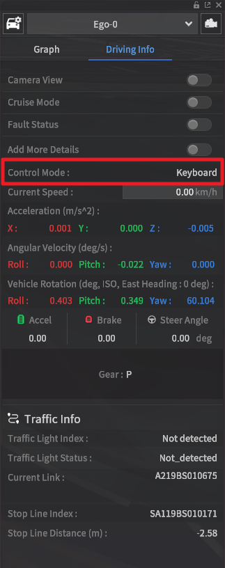
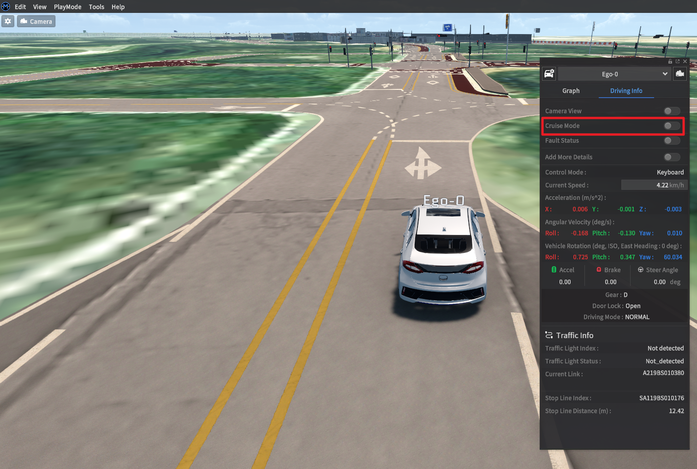
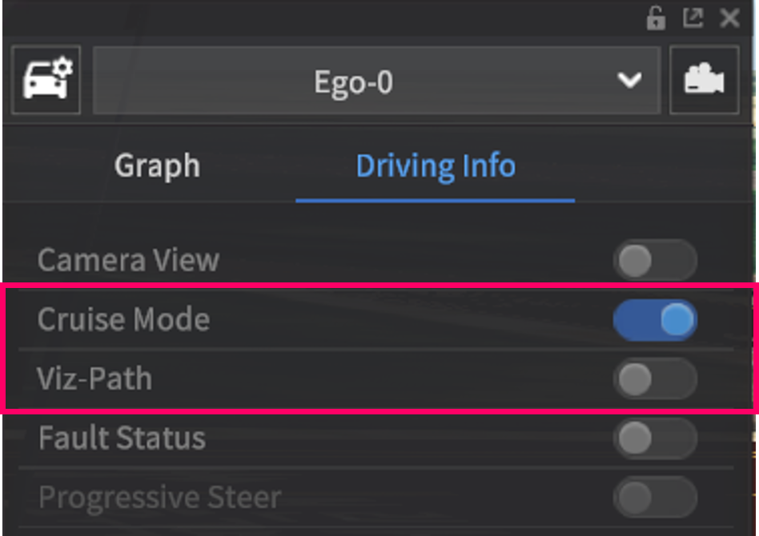
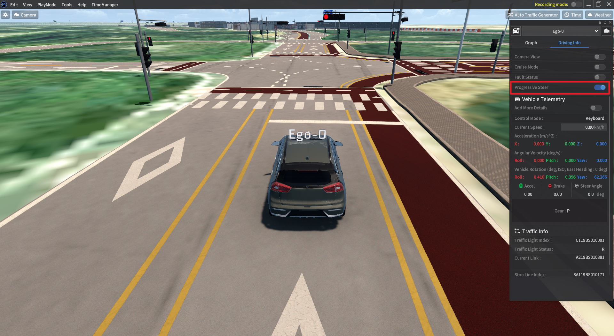

# 시뮬레이터 조작 방법
사용자 인터페이스로 기본적인 화면 조작하기와 더불어, 차량 제어 모드를 변경하고 각 주행 모드 별로 차량을 제어하는 방법에 대하여 설명합니다.

---

## 화면 조작
사용자 입장에서 시뮬레이터 화면 크기 및 방향을 바꾸거나 화면 영역 설정, 화면을 보여주는 카메라 시점 및 성능을 설정하는 방법에 대해 설명합니다.
                                                                                          

### 화면 보기 제어
시뮬레이터에서 화면을 보는 방향과 화면의 크기를 조절합니다.

- **화면 방향**: 화면에 마우스 오른쪽 버튼을 누른 상태에서 마우스를 움직여 시뮬레이터 내 차량을 포함한 주변 객체를 보는 방향을 여러 각도 조절
  
- **확대 및 축소(줌인/줌아웃)**: 화면에 마우스를 클릭한 후 **마우스 휠** 로 화면에 잡힌 객체 초점과의 거리를 확대 및 축소
  

<figcaption>
<b>그림 1. Ego 차량을 보는 방향 및 초점 거리 조절 화면</b>
</figcaption>

### 화면 영역 설정(Viewport Setting ⚙️)
시뮬레이터 성능 및 차량 주행 정보를 시뮬레이터 화면 영역에 표시합니다.

- **Show Performance**: 현재 시뮬레이터 성능 정보
    - **FPS**: 현재 시뮬레이터상에서 측정되는 FPS
    - **Quality**: 시뮬레이터의 Graphics Quality
    - **Memory Usage**: 메모리 사용량

- **Show Vehicle Cluster and Map Info**: 차량 대시보드 및 조향 정보, 차량 및 맵 모델 정보 

???+ note
    **Show Vehicle Cluster and Map Info** 에 대한 자세한 정보는 [클러스터 및 맵 정보 UI](../../ui/clustermap/#cluster-and-map-info-ui_1)을 참고하십시오.

### 카메라 설정 (Camera Setting 🎥)
시뮬레이터 화면을 보여주는 카메라 시점 및 카메라 성능을 설정합니다.

- **Camera View Type**: 카메라 시점 전환
    - **Perspective View**: 카메라가 주행 차량과 독립적인 시점으로 전환
    - **Top View**: 카메라가 지상에서  내려다보도록 전환
    - **Vehicle View**: 카메라가 주행 차량을 바라보는 시점으로 전환              

- **Camera Collision Type**: 카메라 시점과 주변 지형물 간 근접 시 충돌 여부
    - **Zoom**: 카메라 시점과 근접시 주변 지형물이 줌인되며 통과하지 못함
    - **None**: 카메라 시점과 근접시 주변 지형물이 통과됨.

- **Camera Speed**: 카메라 이동 속도 조절
- **Acceleration**: 카메라 이동 가속도 조절
- **Clipping Dist.**: Main Camera 가시 거리 조절  
- **Lerp**: 카메라 이동 시 Lerp 적용 유무

## 차량 제어 모드
시뮬레이터의 차량 제어 모드는 아래와 같이 세 가지가 있습니다. 

- **Auto**: 사용자의 자율주행 SW를 이용한 자동 제어 모드

- **Keyboard**: 키보드를 이용한 수동 제어 모드 

    ???+ note
        **Keyboard** 모드에서 시뮬레이터 조작하는 단축키 정보는 [키보드 제어 모드](#_5)를 확인하십시오.

- **GameWheel**: 로지텍 레이싱 휠(G29)과 같은 외부 입력 장치를 이용한 수동 제어 모드

현재 차량 제어 모드는 아래와 같이 Ego 차량에 대한 **Driving Info** 탭 > **Control Mode** 에서 확인할 수 있습니다.

### 차량 제어 모드 전환
키보드 `Q` 키를 누르면 제어 모드를 변경할 수 있습니다. 

???+ tip
    외부 게임휠이 연결된 상태에서 차량 제어 모드 변경 순서는 **Keyboard → Auto → GameWheel** 입니다.

### 키보드(**Keyboard**) 모드
**Keyboard** 모드에서 차량 제어 시 사용하는 주요 키 정보는 아래와 같습니다.

| Key | Action | Note |
| --- | ------ | ---- |
| `W` | 가속 |  |
| `S` | 브레이크 |  |
| `A` | 좌회전 |  |
| `D` | 우회전 |  |
| `Z` | 좌측 깜박이 | 키를 한번 더 누르면 깜박이 꺼짐 |
| `C` | 우측 깜박이 | 키를 한번 더 누르면 깜박이 꺼짐 | 
| `I` | 주행 위치 초기화 |  | 
| `P` | 기어 P단 |  | 
| `R` | 기어 R단 |  | 
| `N` | 기어 N단 |  | 
| `1` | 기어 D단 | Num Pad의 숫자 1은 해당 안됨 | 

???+ tip
    `F1` 키를 누르면 키보드 제어 모드의 주요키를 포함하여 아래와 같이 시뮬레이터에서 사용하는 키보드 단축키 정보를 확인할 수 있습니다.
    

    키보드 단축키 중 키보드 모드에서 사용하는 **Countrol** 및 **Gear** 키는 Auto 모드에서 동작하지 않습니다.

### 게임휠(**GameWheel**) 모드
시뮬레이터 **22.R4** 버전부터 적용되는 **GameWheel** 모드의 조작 방식은 아래와 같습니다.

???+ note
    게임휠 설치 및 시뮬레이터와 연동하기는 [별도 가이드](https://help-morai-sim.atlassian.net/wiki/external/234651707/ZGJjMTY5NmQwNzA2NGU5OWJkZTUyMzY0MzNjMWQ5YzM)를 참고하십시오.

#### 방향지시등 및 비상등
방향지시등과 비상등 간의 조작 방식은 아래와 같습니다.

- 점등 우선 순위는 비상등이 좌/우 방향 지시등에 우선한다.
  
    예: 좌측 방향지시등 ON 상태에서 비상등을 ON하면 비상등이 동작한다(양측 방향지시등 ON). 
    이 상태에서 비상등을 OFF하면 다시 좌방향 지시등 ON 상태로 복구된다.

- 좌측 방향지시등 ON 상태에서 우측 방향지시등을 ON하면  좌측 방향지시등은 OFF된다.

#### 주차 브레이크
주차 브레이크의 조작 방식은 아래와 같습니다.

- 기어 상태(P/R/N/D)와 상관 없이, 시속 0.5km/h 이하에서 브레이크 페달을 밟고, 주차 브레이크 버튼을 누른다.

- 기어 상태(P/R/N/D)와 상관없이, 엑셀 페달을 밟지 않고 주차 브레이크가 작동 중인 상태에서는 브레이크 페달을 밟지 않아도 차량은 멈춘다(특히 경사로에서 차량이 밀리지 않는다).

주차 브레이크를 해제하기 위한 조작 방식은 아래와 같습니다.

- P 혹은 N단에서 브레이크 페달을 밟고 주차 브레이크 버튼을 누르면 주차 브레이크가 해제된다.

- R 혹은 D단에서 엑셀 입력을 1% 이상 가하면  주차 브레이크가 자동 해제된다(브레이크 입력은 고려하지 않음).

## 차량 주행 모드 
시뮬레이터에서 제공하는 주행 모드의 기능과 각 주행 모드에서 차량을 제어하는 방법에 대해 설명합니다.

### 크루즈(**Cruise**) 모드
**Cruise Mode** 는 Ego 차량을 시뮬레이터에서 자율주행 모드로 주행할 수 있는 기능입니다.

아래와 같이 **Vehicle Info** >  Ego 차량에 대한 **Driving Info** 탭에서 **Cruise Mode** 옵션을 활성화합니다.

**Cruise Mode** 를 활성화하면 하단에 **Viz-Path** 옵션이 생성되는 것을 확인할 수 있습니다.
{:onclick="window.open(this.src)" title="Click view screen" width="300px"}

???+ tip
    **Viz-Path** 는 **Cruise Mode** 상태에서 차량의 주행 경로를 시각화하는 기능입니다.

#### Vehicle Telemetry

**Cruise Mode** 에서 Ego 차량의 주행 파라미터 정보는 아래와 같습니다.

 - **Control Mode**: 현재 차량의 조작 모드(Cruise Mode 활성화 시 Cruise Mode로 표시)
 - **Driving State Init**: 차량의 상태 정보 초기화 옵션(활성화 시 이전 상태 유지 안함)
 - **Current Speed (km/h)**: 현재 차량의 종방향 속력
 - **Driving Parameter**
     - **Desired Speed (km/h)**: 현재 차량이 따라가고 있는 종방향 목표 속력
     - **Constant**: **Link** 와 **Custom** 에 단일 값 입력
     - **Variable**: **Link** 와 **Custom** 에 Range 값 입력
         - **Link (%):** 차량이 따라가는 패스 링크에 Desired Speed가 사전에 부여되어 있으며, Desired Speed에 곱하는 백분율만큼 차량의 실제 Desired Speed 결정
         - **Custom (km/h)**: Default 값, 60으로 설정되어 있으며 사용자가 변경 가능
 - **Acceleration (m/s^2)**: 차량 좌표계 기준 선형 가속력를 표시
 - **Angular Speed (deg/s)**: 차량의 각속력을 표시
 - **Vehicle Rotation (deg, ENU)**: 동북상 좌표계 기준 차량의 회전 포즈를 표시
 - **Accel, Brake**: 액셀과 브레이크 페달의 밟기 정도를 표시(1에 가까울수록 액셀 및 브레이크를 완전히 밟은 상태)
 - **Steer Angle (deg)**: 현재 차량의 조향각을 표시
 - **Gear**: 현재 차량의 기어 상태를 표시

#### Traffic Info
**Cruise Mode** 에서 Ego 차량이 인지하는 교통 정보는 아래와 같습니다.

???+ tip
    **Driving Info** 탭에서 우측 스크롤을 완전히 내려야 위 그림과 같은 **Traffic Info** 의 정보를 모두 확인할 수 있습니다.

- **Traffic Light Index**: 차량이 마주하는 신호등의 Index
- **Traffic Light Status**: 신호등 색상(교통 정보) 
    - **R**: 빨강(정지)
    - **SG**: 초록(직진)
    - **G_with_GLeft**: 초록(직진 및 좌회전)
- **Current Link**: 현재 차량이 패스로 따라가고 있는 mgeo link의 Index
- **Target Link**: 현재 차량이 목표로 하고 있는 MGEO link의 Index
- **Stop Line Index**: 현재 차량이 마주하고 있는 정지선의 Index.
- **Stop Line Distance (m)**: 현재 차량이 마주하고 있는 정지선과의 상대거리
- **Collision Distance (m)**: 앞에 충돌가능성이 있는 물체(차량, 장애물 등)와의 거리를 단위는 m이며 검색되지 않을 시 999로 표현함
  
### Progressive Steer 모드
Progressive Steer 모드는 Ego 차량의 바퀴 조타 속도 및 바퀴 원위치 속도를 제한하는 변수를 활용하여 주행하는 기능입니다. 

아래와 같이 **Vehicle Info** > Ego 차량에 대한 **Driving Info** 탭에서 **Progressive Steer** 옵션을 활성화합니다.

 
Progressive Steer 옵션 활성화하면  Steering Wheel이 회전하고 원위치로 복귀하기가 무거워집니다.

Progressive Steer 모드의 입력 변수는 아래와 같습니다.

- **Movement Rate**: 조향 입력이 있을 때 조타 속도를 제한하는 변수

- **Auto Center Rate**: 조향 입력이 없을 때 바퀴가 원위치로 돌아가려는 속도를 제한하는 변수

Movement Rate와 Auto Center Rate는 사전에 고정된 값으로 설정됩니다. 
Progressive Steer Mode의 각 변수값을 변경하려면 MORAI SIM: Drive의 애드온 모듈인 **Advanced Vehicle Dynamics**  를 추가해야 합니다. 

<figure>

<figcaption>
<b>그림 2. Vehicle Dynamics의 Progressive Steer Mode 설정 화면</b>
</figcaption>
</figure>

### Driving State Init 모드
Driving State Init 모드는 차량 제어 모드 변경 시 Ego 차량의 이전 상태 초기화하는 기능입니다.

아래와 같이 **Ego 차량** / **Driving Info** 탭 > **Vehicle Telemetry** 에서 **Driving State Init** 옵션을 활성화합니다.

**Driving State Init** 옵션은 아래와 같이 동작합니다.

- Toggle On (활성화): 제어 모드 변경 시, Ego Vehicle 상태가 초기화됨
- Toggle Off (비활성화): 제어 모드 변경 시, Ego Vehicle 이전 상태 유지함

