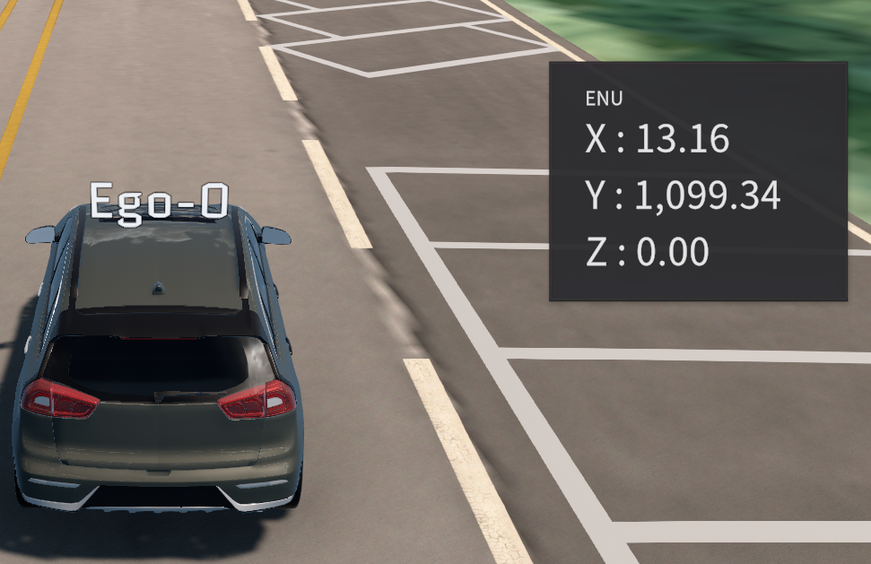
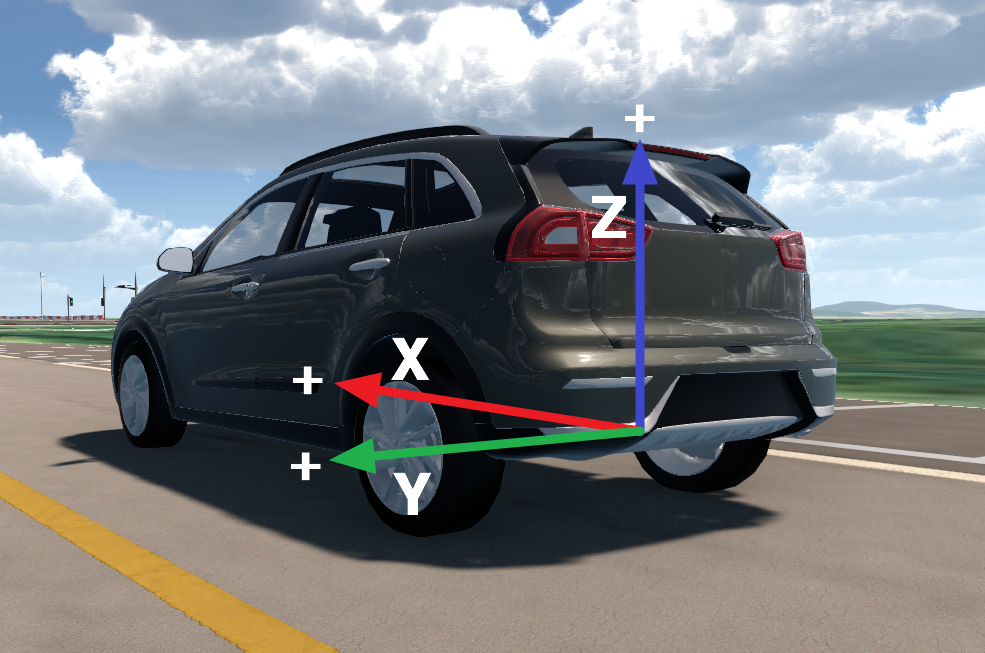

# 필수 정보
시뮬레이터를 사용하기에 앞서, 시뮬레이터 기준 좌표 및 모델 규격과 같이 반드시 숙지해야 할 필수 정보에 대해 설명합니다.

---

## 좌표계
시뮬레이터의 차량, 센서, 맵에서 사용하는 좌표계(Coordinate System)를 설명합니다.  
각 좌표계에 적용된 기준과 좌표값을 해석하는 방법을 설명합니다.

 

### 위치 좌표계
시뮬레이터에서 차량의 위치 및 차량에 장착하는 센서의 위치는 아래 좌표계를 기준으로 나타냅니다.

- 차량 위치 (pose_x, pose_y, pose_z): 시뮬레이터 맵의 원점을 기준으로 한 ENU 좌표 (x, y, z)
  
      예를 들어, 시뮬레이터에서 Ego 차량이 최초 스폰되는 위치에 해당하는 ENU 좌표값은 아래 그림과 같습니다. 

    

    ???+ tip
        시뮬레이터에서 ENU 좌표계를 보려면 원하는 화면 위치에 마우스 스크롤을 클릭합니다. 자세한 사용법은 [유용한 사용팁의 좌표 표시 기능](../useful/#_2)을 참고하십시오.
 

  - 센서 위치 (x, y, z): 차량에 장착하는 센서의 위치 좌표 

      좌표계 원점 및 각 좌표값 x, y, z는 아래의 차량 위치를 기준으로 계산합니다.

    - 원점: 센서를 장착하는 Ego 차량의 뒷바퀴 후륜축 중심
    - x축: 지면과 평행한 축으로 y축과 수직임
    - y축: 뒷바퀴 축
    - z축: 지면에 수직인 축
    
    

 
### 센서 좌표계

시뮬레이터에서 제공하는 센서 모델의 특성에 맞추어, 각 센서를 차량에 장착할 때의 기준으로 하는 좌표계와 이에 따른 센서의 출력 데이터를 확인하는 방법을 설명합니다.

 

#### IMU 좌표계
IMU 센서를 차량에 장착할 시, 아래와 같은 6 자유도계의 값을 고려합니다.

  - x, y, z, roll, pitch, yaw

    <table>
      <tr>
        <td></td>
        <td></td>
      </tr>
    </table>  

IMU 좌표계를 기준으로 IMU 센서에서 검출하는 각 데이터의 좌표값은 아래와 같습니다.

  - **Linear_acceleration**
    - X: IMU 센서의 X 축에 대한 가속도 (전진 + 후진 -)

    - Y: IMU 센서의 Y 축에 대한 가속도 (Left + right -)

    - Z: IMU 센서의 Z 축에 대한 가속도 (UP + Down -)
 

  - **Angular_velocity**

    - X: IMU 센서의 X 축에 대한 각속도 (Roll)

    - Y: IMU 센서의 Y 축에 대한 각속도 (Pitch)

    - Z: IMU 센서의 Z 축에 대한 각속도(Yaw)

    ???+tip
        회전축인 각 x, y, z 축을 기준으로 반 시계 방향이 `+`이고, 시계 방향은 `-`이다.
 

  - **Orientation**

    - X: Quaternion X 벡터

    - Y: Quaternion Y 벡터

    - Z: Quaternion Z 벡터

    - W: Quaternion w 벡터

