# 센서 사용 방법
시뮬레이터 차량에 센서를 장착 및 설정하는 방법과 센서의 검출 데이터에 대하여 설명합니다. 

---

## 기본 사용법
센서 설정창에서 센서를 장착(추가) 및 제거, 설정하는 방법을 설명합니다.

### Sensor Edit Mode 접근
Ego 차량에 센서를 장착 및 설정하려면 아래와 같이 상단 툴바에서 **Edit > Sensor > Sensor Edit Mode (단축키 F3)** 를 클릭합니다.

<figcaption>
<b>그림 1. Sensor Edit Mode 경로</b>
</figcaption>

아래와 같이 Ego 차량 좌측의 센서 설정창에서 원하는 센서를 장착 및 설정할 수 있습니다.
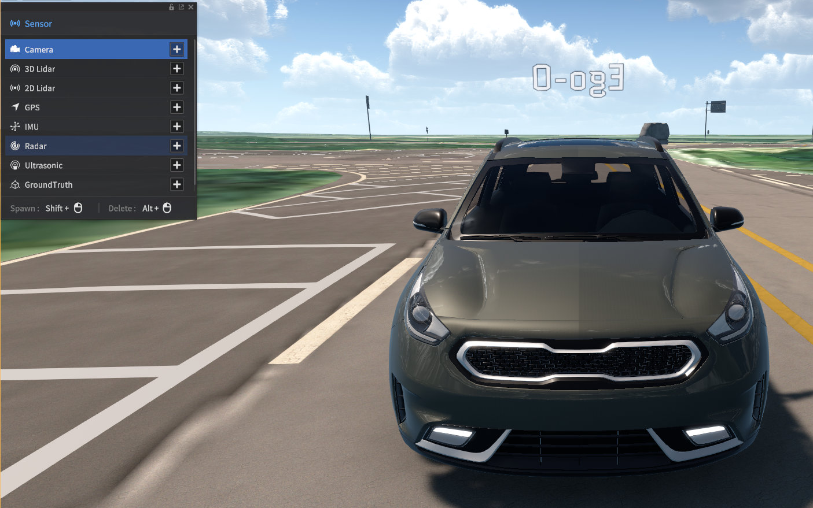

### 센서 장착 및 추가
**1]** 센서 설정창에서 센서 종류를 선택 후 `Shift` 키를 누른 상태에서 장착하고자 하는 차량 위치에 마우스 클릭합니다.

**2]** 아래와 같이 장착 위치에 센서 좌표가 생기는 동시에, 하단에 해당 센서 설정을 위한 센서 속성창(**Sensor Properties**)이 나타납니다.

장착한 센서의 종류는 **Sensor Properties** > **Active List** 탭에서 확인할 수 있습니다. 

다른 종류의 센서를 추가할 경우 위 **1], 2]** 과정을 반복합니다.

### 센서 제거
장착한 센서는 아래와 같은 방법 중 하나로 제거할 수 있습니다.

- **Sensor Properties > Sensor Settings** 에서 **Delete** 클릭 
  {:onclick="window.open(this.src)" title="Click view screen" width="300px"}

-	**Sensor Properties > Active List** 에서 해당 센서에 대한 **휴지통 아이콘** 클릭
  

### 센서 설정
아래와 같은 **Sensor Properties > Sensor Settings** 탭에서 장착한 센서에 대한 입력 파라미터를 설정합니다. 

 
아래의 방법 중 하나로 장착한 센서에 대한 **Sensor Settings** 으로 이동합니다.

- **Sensor Settings** 의 좌측 패널에서 장착한 센서와 매칭하는 아이콘 클릭
  {:onclick="window.open(this.src)" title="Click view screen" width="300px"}

- **Sensor Properties > Active List** 에서 해당 센서에 대한 **설정 아이콘 (⚙️)** 클릭
  {:onclick="window.open(this.src)" title="Click view screen" width="500px"}

각 센서 별 **Sensor Settings** 에서는 센서의 장착 위치 및 회전각, 센서 모델, 검출 데이터 형식(Groud Truth), 네트워크 등을 설정합니다. 

## 센서 별 설정 파라미터
**Sensor Settings** 의 센서 별 설정 파라미터에 대해 설명합니다.

### Camera(카메라)
카메라 센서의 설정 파라미터로 센서 위치 좌표 (X, Y, Z), 센서 회전각 (Roll, Pitch, Yaw), 프레임 출력 속도(Frame Rate), 검출 데이터 형식(Ground Truth), 해상도 및 FOV, 센서 네트워크 등이 있습니다.
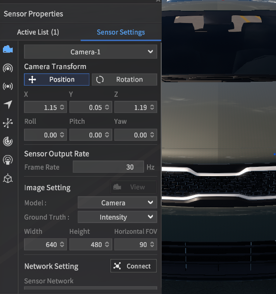{:onclick="window.open(this.src)" title="Click view screen" width="500px"}
<figcaption><b>그림 2. 카메라 센서의 설정 파라미터</b></figcaption>

#### Frame Rate
Camera 센서의 데이터 전송 주기(Hz)를 설정합니다.

 - 툴바에서 Tools > Option > System > Target FPS 의 Frame Rate보다 낮게 전송될 수 있음.
 - 5 ~ 60Hz까지 1Hz 단위로 입력 가능

#### Model
카메라 센서의 종류 및 모델을 선택합니다.

- **LabCamera**: Camera Model과 기능 및 Parameter는 동일하나, 외형이 다른 카메라 센서
- **FishEyeCamera**: Camera Model과 Parameter는 동일하나, 어안렌즈가 적용된 카메라 센서
- **PhysicalCamera**: 실제 카메라 출력 형식을 지원하는 모델(애드온 기능 추가 필요)
  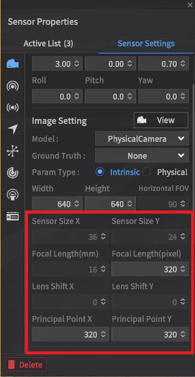{:onclick="window.open(this.src)" title="Click view screen" width="300px"}

    ???+ note
        **PhysicalCamera** 는 **SIM: Drive** 외 애드온 모듈을 별도로 추가해야 사용할 수 있습니다.
 
위 카메라 모델에 따른 화면 뷰는 아래와 같습니다. 
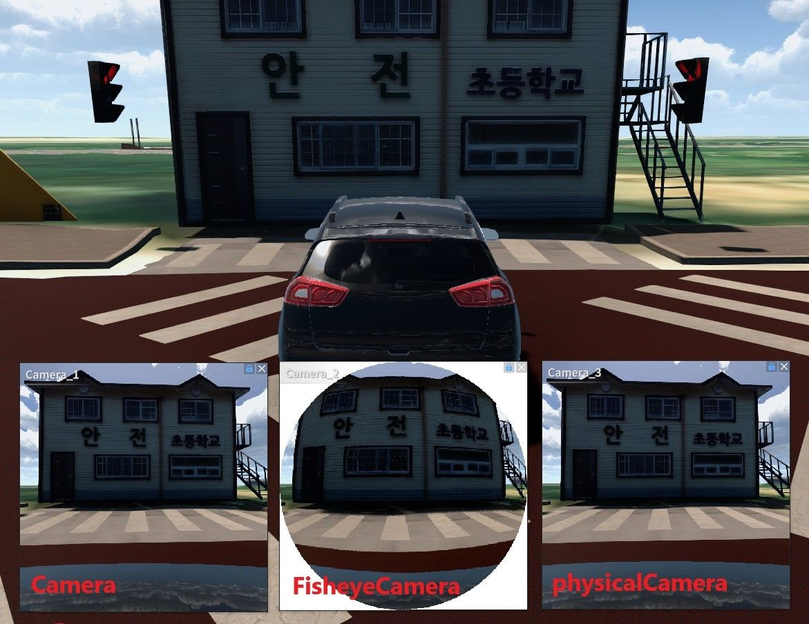{:onclick="window.open(this.src)" title="Click view screen"}
<figcaption>
<b>그림 3. 카메라 모델 별 화면 뷰</b>
</figcaption>

#### Ground Truth
센서에서 검출한 실측 데이터의 형식을 선택합니다.

- **None(Intensity)**: RGB 형식(png)
- **Semantic**: 객체의 클래스 라벨링 맵에 따른 이미지 픽셀 형식(png)

    ???+ note
        **Semantic** 이미지 픽셀 형식의 상세한 정보는 [여기](https://help-morai-sim.scrollhelp.site/morai-sim-standard-kr/sensor-data-format#Sensor%EB%8D%B0%EC%9D%B4%ED%84%B0%ED%98%95%EC%8B%9D-SemanticSegmentation%EC%9D%B4%EB%AF%B8%EC%A7%80){:target="_blank"}를 참고하십시오.

- **Instance**: 객체 클래스에 따른 이미지 픽셀 또는 텍스트 형식(png 또는 txt)
    
    ???+ note
        **Instance** 이미지 및 텍스트 형식의 상세한 정보는 [여기](https://help-morai-sim.scrollhelp.site/morai-sim-standard-kr/sensor-data-format#Sensor데이터형식-Instance이미지및2DBoundingBox){:target="_blank"}를 참고하십시오.

- **Depth**: 객체의 깊이를 나타내는 이미지 픽셀 형식(png 또는 txt). 
    
    Depth 값 검출을 위한 설정 파라미터 예시
    {:onclick="window.open(this.src)" title="Click view screen" width="300px"}

    - **Depth Data bit**: Depth 값를 표현하는 bit 수. 
        실제 Depth GT 값의 Resolution을 결정 (8 bit or 16 bit)
    - **Depth Range (m)**: Depth GT 값을 검출할 수 있는 센서와 객체 간의 최소/최대(Min/Max) 거리. 전체 [0.01, 655.35] 구간 내에서 선택 가능.
        - 검출 이미지에서 최소 거리보다 가까운 객체는 검은색(0)으로 표현됨
        - 검출 이미지에서 최대 거리보다 먼 객체는 검은색(0)으로 표현됨

#### Network Setting
센서의 검출 데이터를 전송하는 통신 네트워크를 설정합니다. 센서 통신으로  ROS, UDP, Apollo를 지 통신 지원합니다.

- **ROS**: 전송 데이터에 대한 Topic, Message, FrameID 설정
    
    센서의 ROS 네트워크 설정 예시
    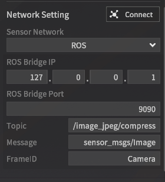{:onclick="window.open(this.src)" title="Click view screen" width="300px"}

- **UDP**: 전송 패킷에 대한 Host 및 Destination IP/Port 설정

    센서의 UDP 네트워크 설정 예시
    {:onclick="window.open(this.src)" title="Click view screen" width="300px"}

- **Apollo**: 전송 패킷에 대한 Host 및 Destination IP/Port 설정

    센서의 Apollo 네트워크 설정 예시
    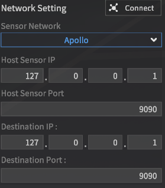{:onclick="window.open(this.src)" title="Click view screen" width="300px"}
  
### LiDAR(라이다)
라이다 센서의 설정 파라미터로 센서 위치 좌표 (X, Y, Z), 센서 회전각 (Roll, Pitch, Yaw), 출력 속도(Rotation Rate), 센서 모델 및 검출 데이터 형식(Intensity Type), Gaussian Noise, 통신 네트워크 등이 있습니다.
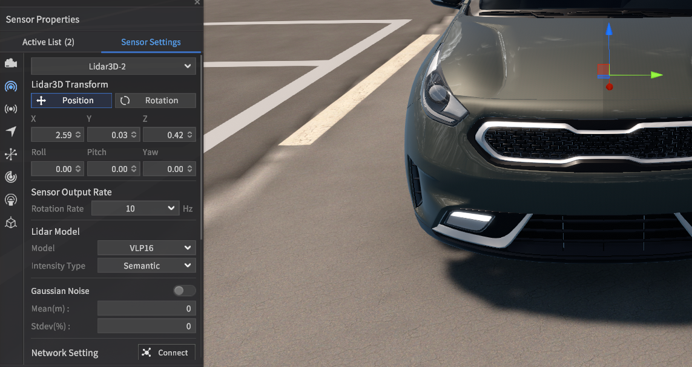{:onclick="window.open(this.src)" title="Click view screen"}
<figcaption>
<b>그림 4. 라이다 센서의 설정 파라미터</b>
</figcaption>

#### Rotation Rate
라이다 센서의 데이터 전송 주기(Hz)를 설정합니다.

 - 툴바에서 **Tools > Option > System > Target FPS** 의 Frame Rate보다 낮게 전송될 수 있음
 - 라이다 센서 모델 별로 설정할 수 있는 범위가 다름

#### Gaussian Noise
아래와 같은 방법으로 라이다 센서의 검출 데이터에 대한 'Gaussian Noise'를 생성합니다.

1. **Gaussian Noise** 토클 활성화
2. **Mean(m)**, **Stdev(%)** 값을 입력하여 Noise 수치를 조절
    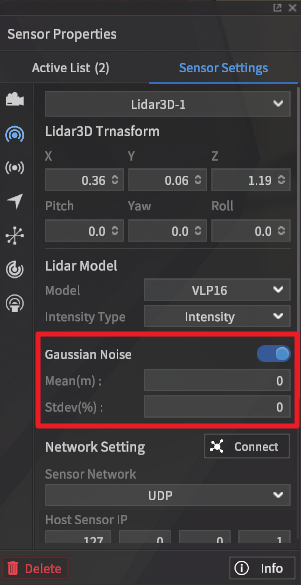{:onclick="window.open(this.src)" title="Click view screen"}

### GPS
GPS 센서의 설정 파라미터로 센서 위치 좌표 (X, Y, Z), 센서 회전각 (Roll, Pitch, Yaw), 데이터 전송 속도(Data Rate), Gaussian Noise, 통신 네트워크 등이 있습니다.
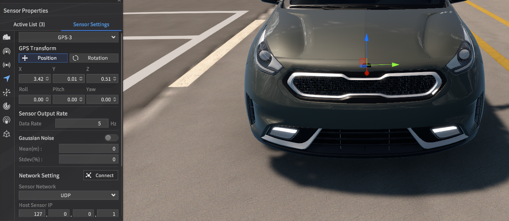{:onclick="window.open(this.src)" title="Click view screen"}
<figcaption>
<b>그림 5. GPS 센서의 설정 파라미터</b>
</figcaption>

???+ note
    GPS 센서는 카메라 센서와 같이 Width, Height, 출력 형식(GT) 등 센서의 특성을 나타내는 Parameter에 대한 설정 기능을 제공하지 않습니다.

#### Data Rate
GPS 센서의 데이터 전송 주기(Hz)를 설정합니다.

- 툴바에서 **Tools > Option > System > Target FPS** 의 Frame Rate보다 낮게 전송될 수 있음
- 5 ~ 100Hz까지 1Hz 단위로 입력 가능
  
#### Gaussian Noise
아래와 같은 방법으로 GPS 센서의 데이터 검출 시, 'Gaussian Noise'를 생성합니다.

1. **Gaussian Noise** 토클 활성화
2. **Mean(m)**, **Stdev(%)** 값을 입력하여 Noise 수치를 조절

### IMU
IMU 센서의 설정 파라미터로 센서 위치 좌표 (X, Y, Z), 센서 회전각 (Roll, Pitch, Yaw), 데이터 전송 속도 (Data Rate), Noise, 통신 네트워크 등이 있습니다.
{:onclick="window.open(this.src)" title="Click view screen"}
<figcaption>
<b>그림 6. IMU 센서의 설정 파라미터</b>
</figcaption>

???+ note
    IMU 센서는 카메라 센서와 같이 Width, Height, 출력 형식(GT) 등 센서의 특성을 나타내는 Parameter에 대한 설정 기능을 제공하지 않습니다.

#### Data Rate
IMU 센서의 데이터 전송 주기(Hz)를 설정합니다.

- 툴바에서 **Tools > Option > System > Target FPS** 의 Frame Rate보다 낮게 전송될 수 있음
- 5 ~ 50Hz까지 1Hz 단위로 입력 가능

#### Noise Filter
IMU 센서는 검출 데이터에 아래와 같은 노이즈 필터를 적용할 수 있습니다.  
사용하는 IMU 센서 특성에 맞추어 각 노이즈 필터의 파라미터를 설정합니다.

- **Bias-Instability Noise**
    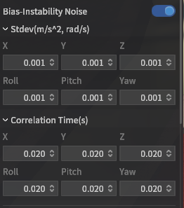{:onclick="window.open(this.src)" title="Click view screen"}

    - **Standard deviation(sigma)**
        - Acceleration: m/s^2 
        - Gyroscope: rad/s
    - **Correlation Time(s)** 

- **Random Walk Noise (Rate Random Walk)**
    {:onclick="window.open(this.src)" title="Click view screen"}

    - **Standard deviation(sigma)**
        - Acceleration: m/s/h^(3/2)
        - Gyroscope: rad/h^(3/2)
 

- **White Noise (Velocity/Angle Random Walk)**
    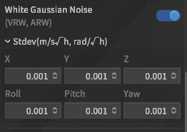{:onclick="window.open(this.src)" title="Click view screen"}

    - **Standard deviation(sigma)**
        - Acceleration: m/s/√h
        - Gyroscope: rad/√h

### Radar(레이더)
레이더 센서의 설정 파라미터로 센서 위치 좌표 (X, Y, Z), 센서 회전각 (Roll, Pitch, Yaw), 데이터 전송 속도 (Data Rate), 통신 네트워크 등이 있습니다.
{:onclick="window.open(this.src)" title="Click view screen"}
<figcaption>
<b>그림 7. 레이더 센서의 설정 파라미터</b>
</figcaption>

???+ note
    레이더 
    센서는 카메라 센서와 같이 Width, Height, 출력 형식(GT) 등 센서의 특성을 나타내는 Parameter에 대한 설정 기능을 제공하지 않습니다.

#### Data Rate
레이더 센서의 데이터 전송 주기(Hz)를 설정합니다.

- 툴바에서 **Tools > Option > System > Target FPS** 의 Frame Rate보다 낮게 전송될 수 있음
- 5 ~ 20Hz까지 1Hz 단위로 입력 가능

## 센서 네트워크 설정
센서 통신으로 ROS 및 UDP 네트워크 설정 파라미터에 대해 설명합니다.

### ROS

#### Camera 센서의 ROS Message

#### LiDAR 센서의 ROS Message Type

### UDP

## 검출 데이터 확인
각 센서에서 검출한 데이터를 확인하는 방법 설명 

### 미리보기로 확인
네트워크 연결 필수

### 캡처 기능으로 확인

## 검출 데이터 형식
검출 데이터의 출력 형식을 센서 별로 설명

### 3D LiDAR

### 카메라

### GPS

### IMU

### Radar

## 센서 특화 기능

### 노이즈 생성

### Custom LiDAR 설정
현재 시뮬레이터에서 제공하는 LiDAR Sensor 외의 사용자가 정의한 LiDAR를 사용하는 방법을 설명
