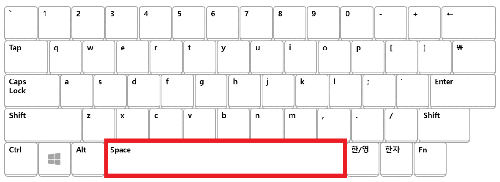

#  캡처 사용법
센서 검출 데이터에 대한 **캡처** 사용법을 설명합니다. 

---

## 캡처 방법
각 센서의  캡처 기능을 사용하면 센서에서 검출한 데이터를 사용자가 원하는 시점 및 장면 별로 저장할 수 있습니다.

캡처 방법은 **Sensor Edit Mode** 에서 센서 장착 후, 원하는 시점에 캡처 키인 `Space` 키를 누르기만 하면 됩니다.

???+ tip
    캡처 기능은 **Sensor Edit Mode** 창의 활성화 및 각 센서별 네트워크 연결과는 상관 없이 동작합니다.

캡처한 데이터는 **Sensor Settings** 에서 설정한 각 센서별 GT 형식에 따라 아래의 경로에 저장됩니다.

- 데이터 저장 경로(Windows 기준):

    `{설치위치}\MoraiLauncher_Win\MoraiLauncher_Win_Data\SaveFile\SensorData\{센서명}`

## Capture Mode
**Capture Mode** 는 센서의 데이터 검출 시, 각 센서에서 지원하는 모든  Ground Truth(GT) 타입의 데이터(예: 카메라의 경우, Intensity, Semantic, Instance, Depth)를 동시에 캡처하는 기능입니다.

???+ note
    Capture Mode는 센서 설정 파라미터로 **GT** 및 **Intensity Type** 을 지원하는 카메라 및 라이다 센서에서만 사용할 수 있습니다.

**Capture Mode** 사용 방법은 아래와 같습니다.

1. **Sensor Properties > Active List** 의 센서 목록에서 
 를 클릭하여 **Capture Mode** 를 활성화합니다. 

    ???+ tip
        **Capture Mode** 가 활성화되면  버튼이 파란색으로 변합니다.

    

1. [캡처 방법](#_2)과 같이 원하는 시점에 `Space` 키를 누릅니다.
2. 시뮬레이터의 센서 데이터 경로에 해당 센서에서 지원하는 모든 GT 타입의 데이터가 한번에 생성된 것을 확인합니다. 

    (예: 카메라 센서의 GT 타입에 해당하는 Intensity, Semantic, Instance(image), Instance(text), Depth 데이터 모두 생성됨)
   

???+ warning 
    **Capture Mode** 가 활성화된 상태에서는 센서 설정에 대한 아래와 같은 제약 사항이 있습니다.
    
    - **Sensor Settings** 에서 GT 타입을 변경할 수 없습니다.
    - **Sensor Settings** > **Network Setting** 에서 네트워크 연결(**Connect**)를 할 수 없습니다. 반대로 **Sensor Settings** > **Network Setting** 에서 네트워크가 연결된 상태에서 **Capture Mode** 를 활성화하면 해당 센서의 네트워크 연결이 자동으로 해제됩니다.