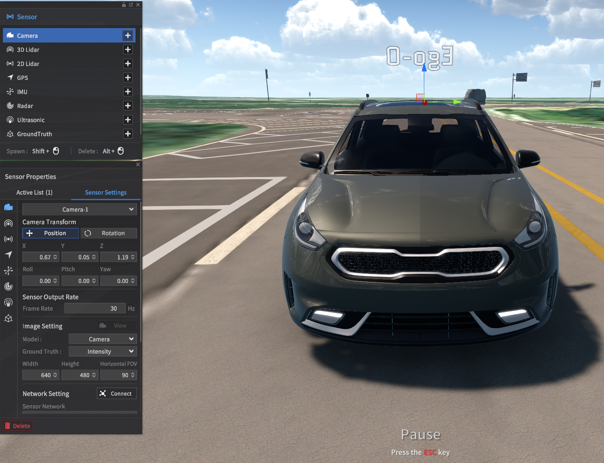
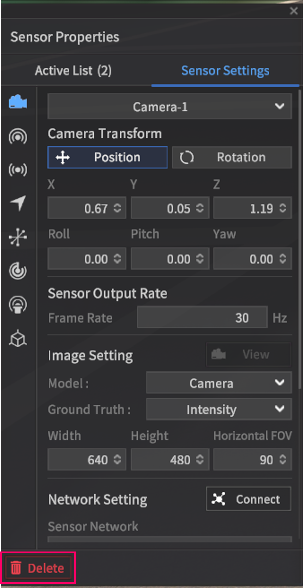
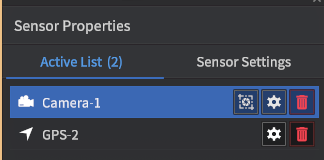
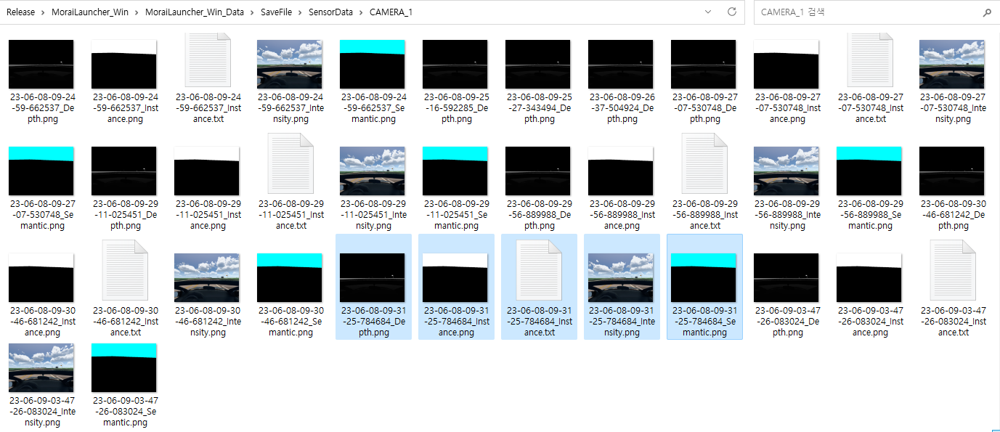
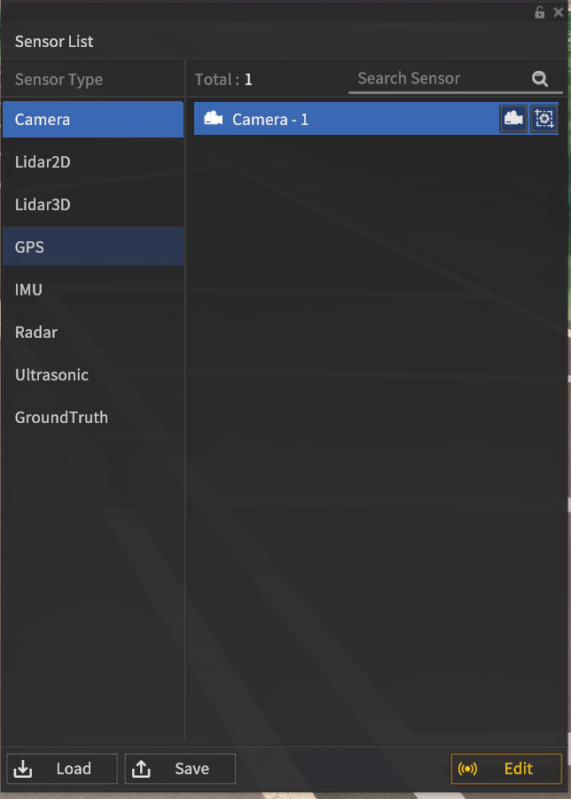

# 기본 사용법

시뮬레이터의 **Sensor Edit Mode** 에서 센서를 장착(추가) 및 제거, 설정하는 방법을 설명합니다.

---

## Sensor Edit Mode 접근
Ego 차량에 센서를 장착 및 설정하려면 아래와 같이 상단 툴바에서 **Edit > Sensor > Sensor Edit Mode (단축키 F3)** 를 클릭합니다.

<figcaption>
<b>그림 1. Sensor Edit Mode 경로</b>
</figcaption>

아래와 같이 Ego 차량 좌측의 센서 설정창에서 원하는 센서를 장착 및 설정할 수 있습니다.

## 센서 장착 및 추가
**1]** 센서 설정창에서 센서 종류를 선택 후 `Shift` 키를 누른 상태에서 장착하고자 하는 차량 위치에 마우스 클릭합니다.

**2]** 아래와 같이 장착 위치에 센서 좌표가 생기는 동시에, 하단에 해당 센서 설정을 위한 센서 속성창(**Sensor Properties**)이 나타납니다.

장착한 센서의 종류는 **Sensor Properties** > **Active List** 탭에서 확인할 수 있습니다. 

다른 종류의 센서를 추가할 경우 위 **1], 2]** 과정을 반복합니다.

## 센서 제거
장착한 센서는 아래와 같은 방법 중 하나로 제거할 수 있습니다.

- **Sensor Properties > Sensor Settings** 에서 **Delete** 클릭 
  {:onclick="window.open(this.src)" title="Click view screen" width="300px"}

-	**Sensor Properties > Active List** 에서 해당 센서에 대한 **휴지통 아이콘** 클릭
  

## 센서 설정
아래와 같이 **Sensor Properties > Sensor Settings** 탭에서 장착한 센서에 대한 입력 파라미터를 설정합니다. 

 
아래의 방법 중 하나로 장착한 센서에 대한 **Sensor Settings** 으로 이동합니다.

- **Sensor Settings** 의 좌측 패널에서 장착한 센서와 매칭하는 아이콘 클릭
  {:onclick="window.open(this.src)" title="Click view screen" width="300px"}

- **Sensor Properties > Active List** 에서 해당 센서에 대한 **설정 아이콘 (⚙️)** 클릭
  {:onclick="window.open(this.src)" title="Click view screen" width="500px"}

각 센서 별 **Sensor Settings** 에서는 센서의 장착 위치 및 회전각, 센서 모델, 검출 데이터 형식(Groud Truth), 네트워크 등을 설정합니다. 

## 설정 정보 저장하기 및 불러오기 
 **Sensor Properties > Active List** 탭에서 하단의 **Load** 및 **Save** 버튼으로 센서의 설정 정보를 불러오거나 저장할 수 있습니다.

<figcaption>
<b>그림 2. Sensor 설정 정보 저장하기 및 불러오기</b>
</figcaption>

센서 설정 정보를 불러오려면 **Load** 를 클릭하여 아래와 같이 **Sensor File Manager** 를 실행합니다.

**Sensor File Manager** 에서는 현재 실행 중인 시뮬레이터의 데이터 저장 경로에 존재하는 센서 설정 파일 리스트를 보여주며, 각 파일을 선택하여 시뮬레이터로 불러오거나 삭제할 수 있습니다. 

???+ tip
    시뮬레이터의 데이터 저장 경로는 
    `{시뮬레이터 설치 위치}\MoraiLauncher_Win\MoraiLauncher_Win_Data\SaveFile\Sensor\{실행 시뮬레이터 버전}`

 
센서 설정 정보를 저장하려면 **Save** 를 클릭하여 아래와 같이 **Save Sensor** 를 실행합니다.

센서 설정 정보는 `json` 파일 형태로 불어올 때와 동일한 경로에 저장됩니다.

## 캡처 사용법
센서의  캡처 기능을 사용하면 센서에서 검출한 데이터를 사용자가 원하는 시점 및 장면 별로 저장할 수 있습니다.

캡처 방법은 **Sensor Edit Mode** 에서 센서 장착 후, 원하는 시점에 캡처 키인 `Space` 키를 누르기만 하면 됩니다.

???+ tip
    캡처 기능은 **Sensor Edit Mode** 창의 활성화 및 각 센서별 네트워크 연결과는 상관 없이 동작합니다.

캡처한 데이터는 **Sensor Settings** 에서 설정한 각 센서별 GT 형식에 따라 아래의 경로에 저장됩니다.

- 데이터 저장 경로(Windows 기준):

    `{설치위치}\MoraiLauncher_Win\MoraiLauncher_Win_Data\SaveFile\SensorData\{센서명}`

### Capture Mode
**Capture Mode** 는 센서의 데이터 검출 시, 각 센서에서 지원하는 모든  Ground Truth(GT) 타입의 데이터(예: 카메라의 경우, Intensity, Semantic, Instance, Depth)를 동시에 캡처하는 기능입니다.

???+ note
    Capture Mode는 센서 설정 파라미터로 **GT** 및 **Intensity Type** 을 지원하는 카메라 및 라이다 센서에서만 사용할 수 있습니다.

**Capture Mode** 사용 방법은 아래와 같습니다.

1. **Sensor Properties > Active List** 의 센서 목록에서 
 를 클릭하여 **Capture Mode** 를 활성화합니다. 

    ???+ tip
        **Capture Mode** 가 활성화되면  버튼이 파란색으로 변합니다.

    

1. [캡처 방법](#_2)과 같이 원하는 시점에 `Space` 키를 누릅니다.
2. 시뮬레이터의 센서 데이터 경로에 해당 센서에서 지원하는 모든 GT 타입의 데이터가 한번에 생성된 것을 확인합니다. 

    (예: 카메라 센서의 GT 타입에 해당하는 Intensity, Semantic, Instance(image), Instance(text), Depth 데이터 모두 생성됨)
   

???+ warning 
    **Capture Mode** 가 활성화된 상태에서는 센서 설정에 대한 아래와 같은 제약 사항이 있습니다.
    
    - **Sensor Settings** 에서 GT 타입을 변경할 수 없습니다.
    - **Sensor Settings** > **Network Setting** 에서 네트워크 연결(**Connect**)를 할 수 없습니다. 반대로 **Sensor Settings** > **Network Setting** 에서 네트워크가 연결된 상태에서 **Capture Mode** 를 활성화하면 해당 센서의 네트워크 연결이 자동으로 해제됩니다.

## 센서 리스트
센서 리스트에서는 현재 차량에 장착한 모든 센서의 목록을 확인하고, 센서 데이터 미리보기(**View** 및 **Info**)와 **Capture Mode** 를 빠르게 실행할 수 있습니다. 

상단 툴바에서 **View > Sensor List** (단축키 **F5**)를 클릭하면 아래와 같은 센서 리스트 창을 확인할 수 있습니다.

-  카메랑 및 라이다 센서의 경우 센서 설정 창(**Sensor Edit Mode**)을 열지 않아도 **Capuure Mode** 를 바로 활성화할 수 있습니다. 활성화 이후 데이터 캡처 및 확인 방법은 위의 [**Capuure Mode** 사용법](#capture-mode)과 동일합니다.
- 각 센서의 네트워크를 연결한 상태에서는 샌서 목록의 🎥 또는 ℹ️ (**미리보기**) 버튼이 활성화딥니다. 각 버튼을 클릭하여 센서 별 실시간 검출 데이터를 확인할 수  있습니다.
- 각 센서 설정 값을 수정하려면 하단의 **Edit** 을 클릭하여 **Sensor Edit Mode** 를 활성화할 수 있습니다.
    
    ???+ tip
        **Sensor Edit Mode** 가 활성화된 상태에서 **Sensor List** 의 **Edit** 버튼을 클릭하면 아무 변화가 없습니다.
 