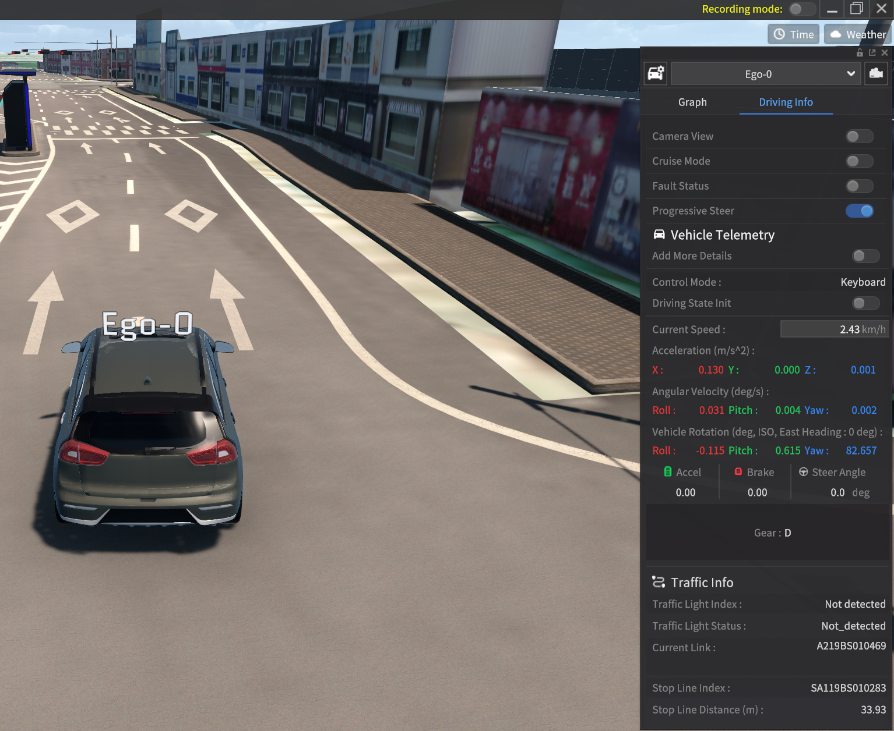
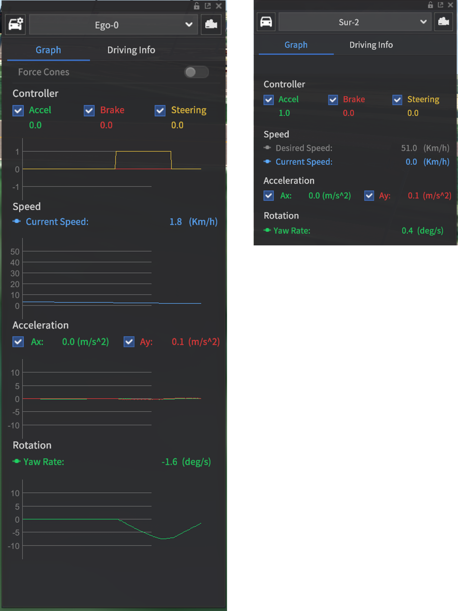
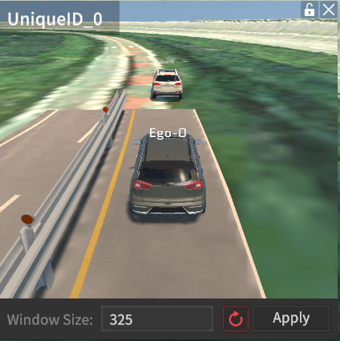
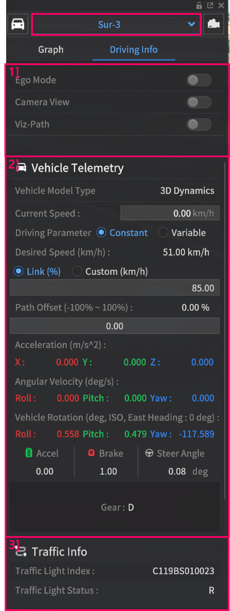

# 차량 정보 UI
 차량의 주행 상태 및 제어 모드를 나타내는 **차량 정보 UI** 에 대해 설명합니다.
 
---

## 차량 정보 UI 접근하기
시뮬레이터 화면에서 Ego 차량을 마우스 클릭(🖱️)하면 화면 우측에 아래와 같은 차량 정보 패널이 나타납니다.

{:onclick="window.open(this.src)" width="500px" title="Click view screen" width="1000px"}
<figcaption>
<b> 그림 1. 차량 정보 UI</b>
</figcaption>

 
## 차량 정보 UI 구성
차량 정보 UI는 크게 **Graph** 와 **Driving Info** 탭으로 구성됩니다. 또한 시뮬레이터에서 동작하는 Ego 차량 및 Surround(Sur) 차량 별로 각기 다른 **Graph** 와 **Driving Info** 를 확인할 수 있습니다.

???+ tip
    Ego 차량과 Sur 차량 간의 정보를 전환하려면 차량 정보 패널 상단 좌측의 아래와 같은 차량 아이콘을 클릭합니다. 

    {:onclick="window.open(this.src)" title="Click view screen" width="500px"}
     

???+ note
    시뮬레이터 최초 실행 시 차량 정보 UI에는 Ego 차량 정보만 존재하므로, 차량 아이콘을 클릭해도 Sur 차량 정보를 
    확인할 수 없습니다. 
    [시나리오 편집 기능](../../how/scenario)에서 Sur 차량을 추가해야 차량 정보 UI에서 해당 Sur 차량 정보를 확
    인할 수 있습니다.

 
### Graph 탭
차량 정보 패널에서 좌측 **Graph** 탭을 클릭하면 주행 중인 차량의 제어 상태(가속, 브레이크, 조향 유무), 현재 속도, 가속도, 회전 각속도(Yaw Rate) 값을 아래와 같이 실시간 그래프로 확인할 수 있습니다.

{:onclick="window.open(this.src)" width="500px" title="Click view screen" width="1000px"}
<figcaption>
<b> 그림 2. 주행 차량(Ego 및 Sur 차량)의 Graph UI 구성</b>
</figcaption>

 
### Driving Info 탭
차량의 주행 정보를 Ego 및 Sur 차량 별로 표시합니다.

#### Ego 차량 Driving Info
 Ego 차량의 **Driving Info** 탭은 아래와 같이 **1] 주행 옵션**, **2] 주행 상태(Vehicle Telemetry)**, **3] 교통 정보(Traffic Info)** 로 구성됩니다. 

{:onclick="window.open(this.src)" width="300px" title="Click view screen"}
<figcaption><b> 그림 3. Ego 차량의 Driving Info 탭 구성</b></figcaption>

 
Ego 차량의 **Driving Info** 탭에서 제공하는 1] 주행 옵션은 아래와 같습니다.

 - **Camera View**: Ego 차량의 주행 화면 보기 옵션

    ???+ tip
        **Camera View** 를 활성화하면 아래와 같이 후방에서 촬영한 Ego 차량의 주행 화면이 UI 패널 우측에 나타납니다. **Window Scale** 값을 직접 입력하여 화면 창 크기를 조절할 수 있습니다.
        {:onclick="window.open(this.src)" width="300px" title="Click view screen"}

 - **Cruise Mode**: 차선, 신호등, 앞차와의 차간 거리 등을 자동으로 인지하며 주행하는 옵션
 - **Fault Status**: ROS 통신으로 차량의 고장 상태를 확인하는 옵션
 - **Progressive Steer**: Ego 차량의 바퀴 조타 속도 및 바퀴 원위치 속도를 제한하는 변수를 활용하는 옵션

    ???+ warning
        **Progressive Steer** 옵션은 MORAI SIM: Dirve에서 Add-on 기능으로 제공하는 
        **Vehicle Dynamics** 모듈을 추가해야 사용할 수 있습니다. 또한 **Cruise Mode** 옵션이 활성화된 상태에서는 사용할 수 없습니다.

 
Ego 차량의 **Driving Info** 탭에서 제공하는 **2] 주행 상태(Vehicle Telemetry)** 옵션 및 정보는 아래와 같습니다.

  - **Add More Details**: 차량 좌표계 기준에서 주행 차량의 바퀴 상태 세부 정보 보기 옵션
  - **Control Mode**: Ego 차량을 제어하는 모드 옵션, 제어 모드로 **Keyboard**(디폴트), **Auto**, **Game Wheel** 이 있음

    ???+ tip
        키보드 `0`로 차량 제어 모드를 변경합니다. 각 제어 모드에서의 기본 조작 방법은 [MORAI SIM: Drive  사용하기의 기본 조작 방법](../../how/basic-controls/#other-controls)을 참고합니다.

  - **Driving State Init**: 제어 모드 변경 시 Ego 차량의 상태를 초기화하는 옵션

    ???+ tip
        - **Driving State Init** 옵션 활성화 시, 제어 모드를 변경하면 Ego 차량의 상태가 초기화됨
        - **Driving State Init** 옵션 비활성화 시, 제어 모드를 변경하면 Ego 차량의 이전 상태가 유지됨

  - **Current Speed**: Ego 차량의 현재 주행 속도(km/h)
  
    ???+ tip
        Current Speed 값 표시란에 직접 숫자를 입력 후 `Enter` 키를 누르면 순간적으로 Ego 차량을 해당 속력로 주행할 수 있습니다.

  - **Acceleration**: Ego 차량의 주행 가속도(m/s^2)
  - **Angular Speed**: Ego 차량의 긱속도(deg/s)
  - **Vehicle Rotation**: Global ENU 좌표계에서 Ego 차량의 회전각(deg)
  - **Accel**: Ego 차량에 Accel 인가 유무(0 or 1)
  - **Brake**: Ego 차량에 Brake 인가 유무(0 or 1)
  - **Steer Angle**: 조향에 따른 Ego 차량 앞바퀴의 회전각(deg). 차량마다 Min/Max Wheel 각도 사양이 다름.
  - **Gear**: Ego 차량의 기어 상태(P/R/N/D)

 
Ego 차량의 **Driving Info** 에서 제공하는 **3] 교통 정보(Traffic Info)** 는 아래와 같습니다.

  - **Traffic Light Index**: Eog 차량의 현재 위치에서 바라보는 신호등의 인덱스 정. 바라보는 신호등이 여러 개이거나 없는 경우 `Not detected`로 표시됨.
  
  - **Traffic Light Status**: Eog 차량에서 인식한 신호등의 상태(색상)을 표시(R, Y, SG 등). 인식한 신호등이 없는 경우 `Not detected`로 표시됨.

  - **Current Link**: 현재 Eog 차량이 위치하는 Link 정보

  - **Stop Line Index**: Eog 차량의 현재 위치에서 바라보는 Stop Line 정보. Stop Line이 없는 경우, `Not detected`로 표시됨.

  - **Stop Line Distance**: Ego 차량이 인식한 신호등과 Ego 차량 간의 거리(m)

 

#### Sur 차량 Driving Info
Sur 차량의 **Driving Info** 탭은 아래와 같이 **1] 주행 옵션**, **2] 주행 상태**, **3] 교통 정보** 로 구성됩니다. 

{:onclick="window.open(this.src)" width="300px" title="Click view screen"}
<figcaption><b> 그림 4. Ego 차량의 Driving Info 탭 구성</b></figcaption>

Sur 차량의 **Driving Info** 탭에서 제공하는 1] 주행 옵션은 아래와 같습니다.

 - **Ego Mode**: 설명 필
 - **Viz-Path**: 설명 필요

 
Sur 차량의 **Driving Info** 탭에서 제공하는 **2] 주행 상태(Vehicle Telemetry)** 옵션 아래와 같습니다.

 - **Desired Speed Mode**: NPC 차량의 목표 속력(km/h)
      - **Link(%)**: 목표 속력에서 해당 비율만큼을 목표속력으로 설정함(%)
      - **Custom(km/h**): 해당 고정 값을 목표 속력으로 설정함. 이때 ACC나 곡률에 의한 감속등은 내부 알고리즘으로 자동 결정된다. 즉, 해당 차량에 설정할 수 있는 최대 속력를 의미하는 것이며 모든 주행 상태에서의 목표 속력를 의미하는 것은 아니다.
      - **Path Offset(%)**: 설명 필요

 
Sur 차량의 **Driving Info** 탭에서 제공하는 **3] 교통 정보(Traffic Info)** 는 아래와 같습니다.

  - **Target Link**: 차량이 주행 목표로 하는 링크 인덱스를 표시

  - **Stop Line Index**: 현재위치에서 바라봐야하는 Stop Line의 정보를 표시. 없는 경우 Not detected로 표시.

  - **Stop Line Distance(m)**: 인식된 신호등과 Sur 차량 간의 거리를 표시

  - **Collision Distance(m)**: 전방 충돌 가능성이 있는 물체(차량, 장애물 등)와 Sur 차량 간 거리를 표시. 인식되지 않으면 999로 표시됨.

???+ tip
    Sur 차량의 **Driving Info** 탭에는 존재하나 위에 설명에서 언급하지 않은 정보 및 옵션은 [Ego 차량 Driving Info 탭](#ego-driving-info) 설명을 참고하십시오.